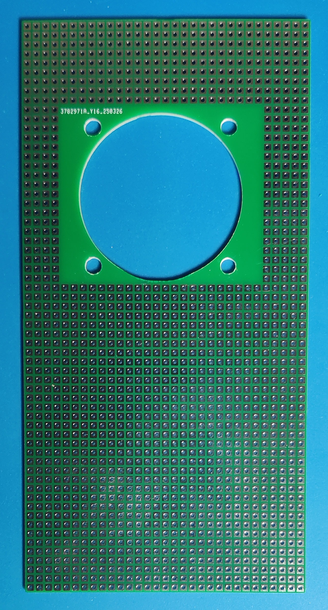
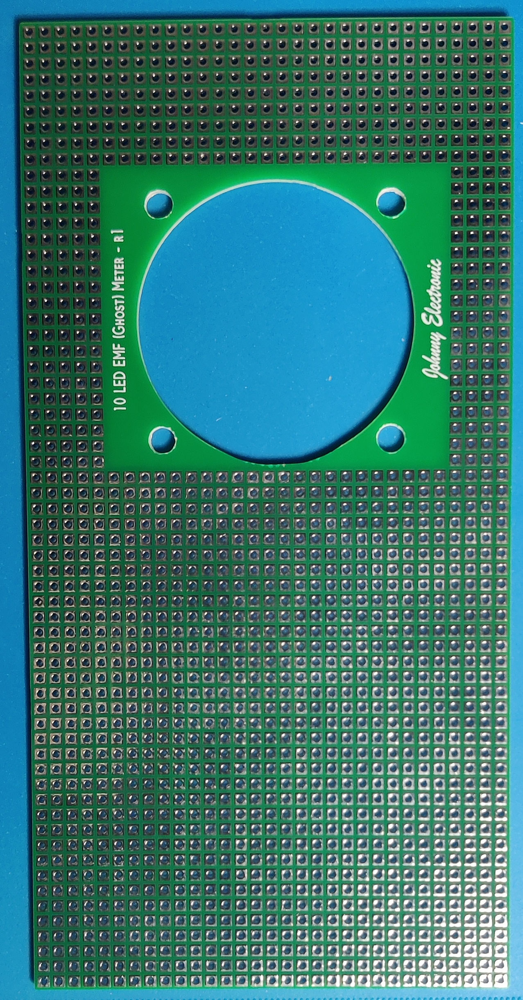
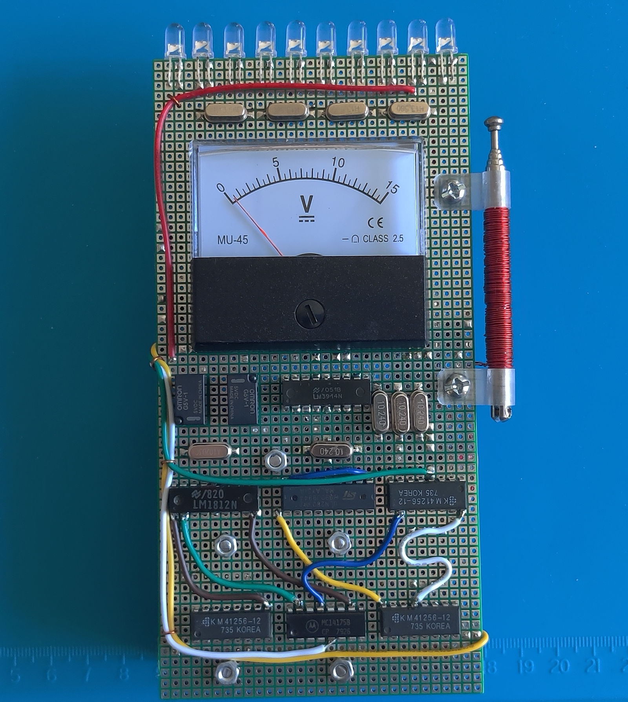
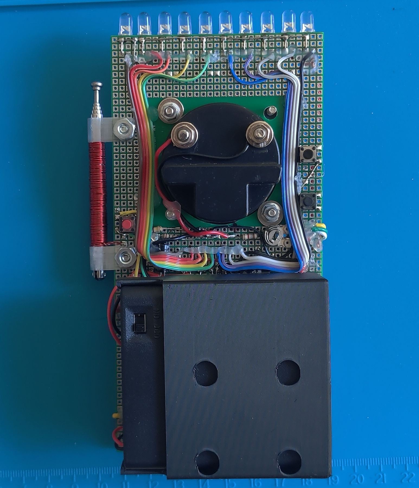

# 10 LED EMF Meter Replica - Olivia's Meter (r1)

**Blank PCB**

  

**Example of Assembled EMF Meter**

  

Here is the documentation and support files for the Supernatural 10 LED EMF Meter Replica that Olivia used in season 4 episode 2. 
To assemble this circuit board you must be comfortable working with and soldering electronic parts.
A partial build video is available on my YouTube site. This meter is built on a perfboard so assembly is at the discreation of the hunter (Ah, builder).
A schematic is available along with a Bill of Materials (BOM). 

## Technical Details

* Dimensions: 79 mm x 158 mm 
* Uses 4 AA batteries
* 10 LEDS driven by an LM3914 (Set to BAR mode)
* ATtiny85 controller
* DFPlayer module for audio

This meter was only shown in one episode of the series but was a very standout meter. This is a prop only version with no EMF detection abilities. It was hand crafted on perfboard using point to point solder connections.
This is truly a one-of-a-kind meter. The meter has a test button similar to the other EMF meter for creating custom EMF events and also has 3 pre-programmed event sequences. 
These pre-programmed sequences can be added to or changed by reprogramming the ATtiny85 code.

An ATTiny85 is used to control the DFPlayer sound board and the analog meter deflection. 
The ATTiny85 is socketed and can be reprogrammed if needed. 

## Purchasing
[Visit my Tindie Store](https://www.tindie.com/stores/johnnyelectronic/)

## Directories

-[Schematics](schematics/)

-[Documents](doc/)

-[Images](img/)

-[Source code](src/)

-[3D files](3D/)

## Licensing

This work is licensed under Creative Commons Attribution-ShareAlike 4.0 International. 
To view a copy of this license, visit [https://creativecommons.org/licenses/by-sa/4.0/](https://creativecommons.org/licenses/by-sa/4.0/)

Distributed as-is; no warranty is given.

