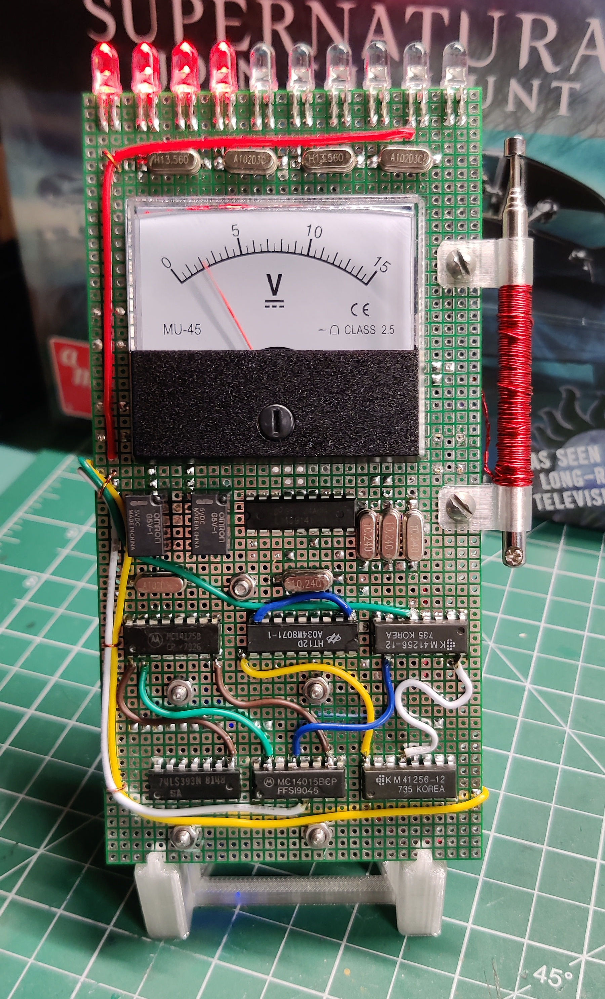

# 10 LED EMF Meter Replica - Olivia's Meter (r2)

### Updated version ###

**Blank PCB**

  

**PCB Fabrication Sponsored By**

**Example of Assembled EMF Meter**

    

Here is the documentation and support files for the Supernatural 10 LED EMF Meter Replica that Olivia used in season 4 episode 2. 
To assemble this circuit board you must be comfortable working with and soldering electronic parts.
A build video is available on my YouTube site. This meter uses through hole and surface mounted parts. The smallest SMT will be a 0805 package.
A schematic is available along with a Bill of Materials (BOM). 

## Technical Details

* Dimensions: 79 mm x 158 mm 
* Uses 4 AA batteries
* 10 LEDS driven by an LM3914N (Set to BAR mode)
* ATTiny1604 controller
* DFPlayer module for audio
* 9 Pre-Programmed EMF sequences

This meter was only shown in one episode of the series but was a very standout meter. This is a prop only version with no EMF detection abilities. 
This is truly a unique meter. The meter has a test button similar to the other EMF meter for creating custom EMF events and also has 9 pre-programmed event sequences.
The pre-programmed sequences can be selected using a rotary switch and then a quick press of the Program/Test button to start the sequence. Using the 0 position each button
press will rotate to the next programmed sequence. These pre-programmed sequences can be added to or changed by reprogramming the ATtiny code.

An ATTiny1604 is used to control the DFPlayer sound board and the VU/LED meter deflection. 
The ATTiny1604 can be reprogrammed using the UPDI port. 

## Purchasing
[Visit my Tindie Store](https://www.tindie.com/stores/johnnyelectronic/)

## Directories

-[Schematics](schematics/)

-[Documents](doc/)

-[Images](img/)

-[Source code](src/)

## Licensing

This work is licensed under Creative Commons Attribution-ShareAlike 4.0 International. 
To view a copy of this license, visit [https://creativecommons.org/licenses/by-sa/4.0/](https://creativecommons.org/licenses/by-sa/4.0/)

Distributed as-is; no warranty is given.

