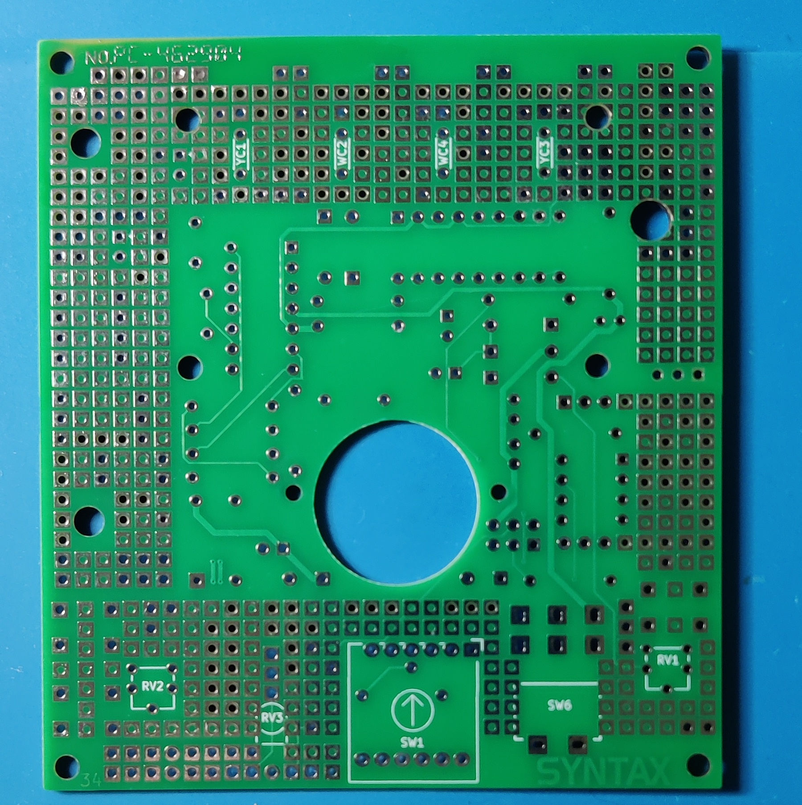
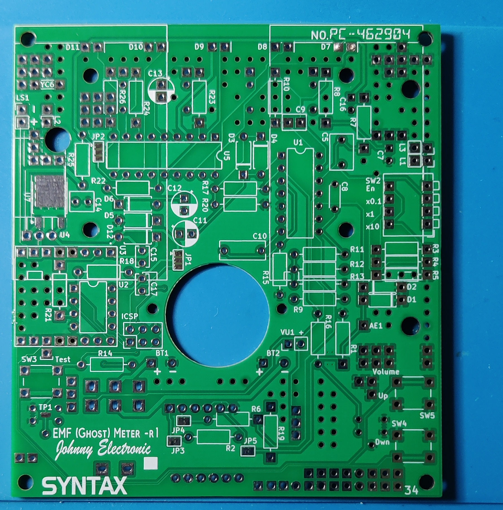
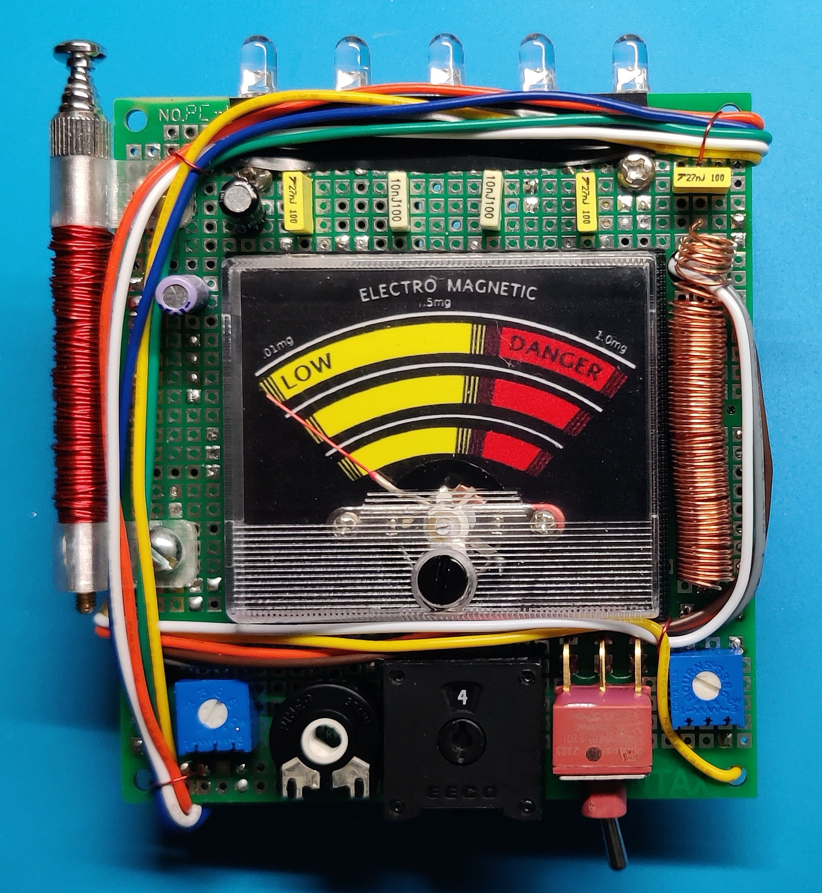
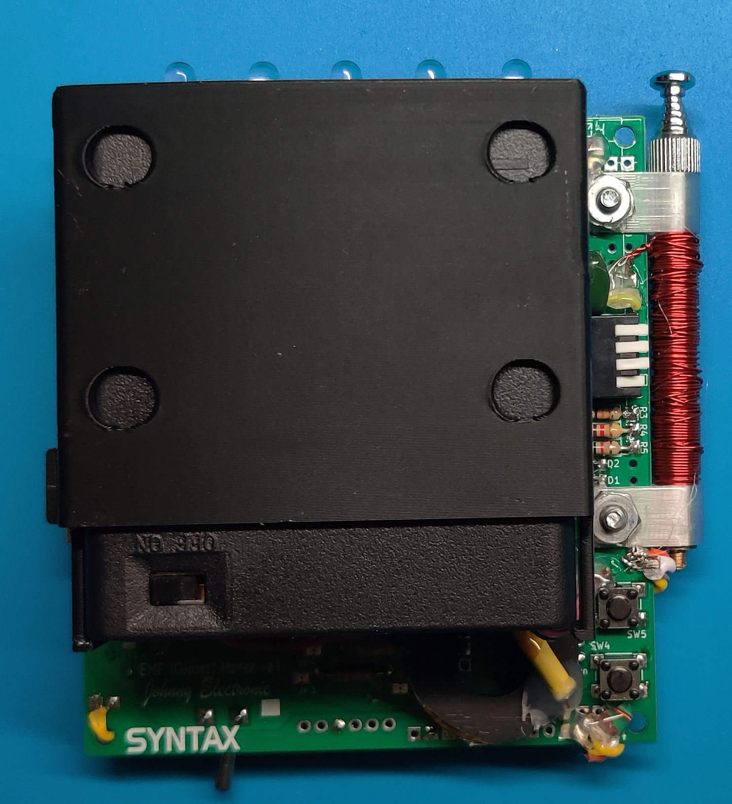

# EMF Meter Replica

**Blank PCB**

  

**Example of Assembled EMF Meter**

  

Here is the documentation and support files for building and using the Supernatural EMF Meter Replica. 
To assemble this circuit board you must be comfortable working with and soldering electronic parts.
A full assembly and usage guide is available in the "doc" folder as well as a 2 part video series.

## Technical Details

* Dimensions: 86 mm (3.46") x 95 mm (3.74") 
* Options for 9v or AA batteries
* 5 LEDS driven by an LM3914 (Jumper Option for DOT/BAR Mode)
* ATtiny85 controller
* DFPlayer module for audio
* Supports 3326 or 3386 F and P series blue potentiometers
* Supports PT10 or PT15 black potentiometer
* Optional 5th yellow capacitor
* Uses a functional EECO switch to select gain for the E-Field detector and can support a number of different EECO switches. Specifically, EECO 2700 series -02, -19, -31, -33, -41, -44 will work as is and others can be adapted to work. The PCB footprint supports 6 and 12 pin switches.
* Flexible wiring options.

This is a functional EMF meter that can detect both Electric and Magnetic fields. 
It can also be built as a simple prop by not populating the analog components. 
The meter was designed to replicate a variety of the meter configurations used in the TV series.

An ATTiny85 is used to control the DFPlayer sound board and the analog meter deflection. 
Programming for the ATTiny85 can be done before mounting and can also be accomplished using an In-Circuit Serial Programming (ICSP) port to program the mounted part on the board. 
There is a jumper option (JP1) to select either the main board power or to use the ICSP port for programming power. I also have available a soft touch programming cable for programming this part. 

Check out the build document for more details.

> [!NOTE]
> [See My YouTube Channel for examples on programming ATTiny parts using a softtouch cable](https://www.youtube.com/@Johnny_Electronic/playlists)

## Purchasing
[Visit my Tindie Store](https://www.tindie.com/stores/johnnyelectronic/)

## Directories

-[Schematics](schematics/)

-[Documents](doc/)

-[Images](img/)

-[Source code](src/)

-[3D files](3D/)

-[MP3 files](mp3/)

## Licensing

This work is licensed under Creative Commons Attribution-ShareAlike 4.0 International. 
To view a copy of this license, visit [https://creativecommons.org/licenses/by-sa/4.0/](https://creativecommons.org/licenses/by-sa/4.0/)

Distributed as-is; no warranty is given.

