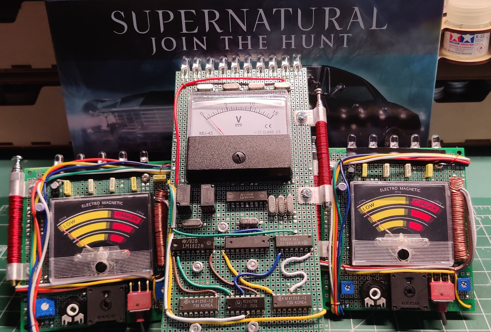

# EMF Meter Replicas - Supernatural TV Series

## EMF Meters

- [Sam and Deans Classic EMF Meter](EMF_Meter_Replica/)
- [Olivia's 10 LED EMF Meter](10_LED_EMF_Meter_Replica/)

These meters are replicas of the ones seen in the Supernatural TV series.

* Sam and Deans Classic EMF Meter
This is the classic meter seen in many of the Supernatural episodes. It can be configured with 4 or 5 capacitors at the top, supports a variety of variable resistors and 9v or AA batteries.
This meter is a functional EMF meter and can detect Electric and Magnetic fields. It also has a test button to create EMF events any time.

* Olivia's 10 LED EMF Meter
This meter was only shown in one episode of the series but was a very standout meter. This is a prop only version with no EMF detection abilities. It was hand crafted on perfboard using point to point solder connections.
This is truly a one-of-a-kind meter. The meter has a test button similar to the other EMF meter for creating custom EMF events and also has 3 pre-programmed event sequences. These pre-programmed sequences can be added to or changed by reprogramming the ATtiny85 code.

> [!NOTE]
> [See My YouTube Channel for videos on assembly and operation of these meters](https://www.youtube.com/@Johnny_Electronic)

## Purchasing
[Visit my Tindie Store](https://www.tindie.com/stores/johnnyelectronic/)

## Licensing

This work is licensed under Creative Commons Attribution-ShareAlike 4.0 International. 
To view a copy of this license, visit [https://creativecommons.org/licenses/by-sa/4.0/](https://creativecommons.org/licenses/by-sa/4.0/)

Distributed as-is; no warranty is given.

